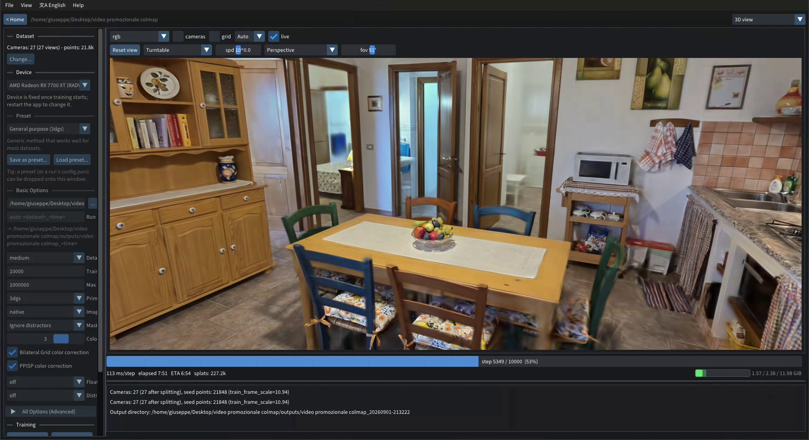

# Gaussian Camera Rig

A dependency-free Blender add-on for generating multiple camera rotations from one fixed viewpoint. It is intended as a small helper for Gaussian splatting / panoramic capture planning.



## Requirements

- Blender 3.6 or newer.
- No additional packages for the add-on itself.
- `pycolmap` and NumPy are optional and used only by the independent model-validation script.

## Install

1. Install `gaussian_camera_rig.zip` from Blender's **Edit → Preferences → Add-ons → Install from Disk…** (called **Install…** in older versions). The archive in this repository is ready to install. To rebuild it from source, run `python scripts/build_addon_zip.py` from the repository root.
2. Enable **3D View: Gaussian Camera Rig**.
3. In a 3D View, open the sidebar with `N` and choose the **Gaussian Cameras** tab.

## Use

Place and orient the 3D View where you want the camera rig, then choose a preset and click **Generate Cameras**. You can also press **Ctrl+Shift+Alt+C** in the 3D View, including while using Walk or Fly navigation, to generate the cameras. During Walk/Fly, **Ctrl+Shift+C** is also accepted as a simpler fallback. Camera 1 uses the current viewport position and orientation. Ring, arc, and spherical presets keep that position for every camera and vary the rotation; the 2D grid varies camera positions while keeping the current looking direction.

Available presets:

- **360° horizontal ring** — rotations evenly spaced around the horizon.
- **180° front arc** — rotations distributed across the half-circle in front of the current view.
- **2D camera grid** — a view-relative X × Y camera array. Set **Camera count** for the total number of cameras, then set **X spawn range** and **Y spawn range** with two 0°–360° sliders. The array is centered on the current view, and every generated camera keeps the exact direction of the viewport/camera currently being looked through.
- **360° sphere** — Fibonacci-distributed viewing directions around the whole sphere.
- **Sphere — ignore top**, **ignore left**, **ignore right**, or **ignore left + right** — spherical viewing directions with those regions removed.

The horizontal ring and front arc rotate the complete current camera pose around world Z. This keeps the same pitch for every camera, so if the 3D View is looking down, all cameras continue looking down. The spherical presets intentionally vary pitch to cover the sphere.

The **Lens** value is independent from the camera you are currently inside and is applied identically to every generated camera. For example, set it to `50 mm` and every generated camera will render with the same 50 mm framing. Generated cameras are kept in a `GS_Cameras` collection and all share the current viewport location.

The camera-view zoom slider in the 3D View is only a viewport display control. Render framing comes from the camera data; the add-on keeps that data consistent across the batch.

The generation operator is a normal Blender undo step, so `Ctrl+Z` undoes the latest generation. The panel also includes **Undo Last Camera Batch**, which removes the exact cameras from the last batch without affecting other cameras.

## Export a COLMAP dataset

The **COLMAP Export** section in the same **Gaussian Cameras** sidebar exports every perspective camera object currently in the scene, including cameras you created yourself and cameras generated by this add-on. The active scene camera is not special: all cameras are included.

Choose an output directory and click **Export COLMAP Dataset**. Version **1.16.0** defaults to **Camera rays**, sampling every pixel from every perspective scene camera and using colors from the exported images.

With **Render images** enabled, missing images are rendered before sampling. **Skip existing images** reuses images only after they decode successfully and match the export dimensions; invalid images are rendered again. Disable skipping to force fresh renders. With **Render images** disabled, camera-ray export requires matching images already in `images/`. **Image format** selects the expected PNG or JPEG filenames in both cases. Existing images must match the current geometry, frame, cameras, and render settings; dimensions alone cannot establish that they are up to date.

The exporter writes the same layout as previous versions:

- `cameras.txt` — one PINHOLE camera entry per scene camera.
- `images.txt` — one camera pose per scene camera, using Blender's world transform converted to COLMAP coordinates.
- `points3D.txt` — world-space surface intersections, saved-image RGB colors, and reciprocal image tracks. These points come directly from known Blender geometry and do not require feature matching or reconstruction.
- `images/` — one rendered PNG or JPEG per camera when image rendering is enabled.

Non-perspective cameras (orthographic, panoramic, or fisheye) are reported as skipped because standard COLMAP pinhole models cannot represent them directly. If render border/cropping or multiview is enabled, the exporter temporarily disables it for full-frame PINHOLE images and restores the exact scene settings afterward. Camera scale is removed from poses; sheared or reflected camera transforms produce an actionable error.

### Camera-ray controls

- **Export Blender points** enables or disables point generation. The saved property remains `export_mesh_points` for compatibility with existing scenes/scripts.
- **Point source: Camera rays** is the default. **Mesh vertices** retains the legacy method: original mesh vertices, first-material colors, and projection-only tracks without occlusion checks.
- **Pixel spacing: 1** casts a ray through every pixel center at the effective render resolution. A spacing of 2 samples roughly one quarter as many pixels; 4 samples roughly one sixteenth. There is no automatic point cap or density reduction.
- **Merge distance: 0.000001** is in Blender world units. Hits merge only within this distance and on the same evaluated instance triangle. The retained point stays on an actual intersection. Increase the distance deliberately to merge more samples; adjacent triangles and separate objects remain separate.
- **Pass through glass** is enabled by default. Faces using Blender Glass, Transparent, Refraction, Translucent, Principled Alpha, or Principled Transmission inputs are omitted from the ray BVH, allowing rays to reach opaque geometry behind a glass pane. Turn it off when you want the glass surface itself to be the sampled occluder.
- **Include glass borders** is enabled by default. Transparent-face boundary edges are sampled at the selected pixel spacing and exported as tracked 3D points, while rays still pass through the pane interior. Disable it if the glass outline should not contribute points.

The exporter builds one world-space BVH from evaluated meshes and mesh instances in the active view layer. It includes objects hidden only in the viewport, honors render visibility and excluded collections, and restores temporary visibility changes immediately after building the geometry index. Each ray keeps the first eligible surface between the camera's near and far clipping planes. With **Pass through glass**, the first eligible surface is opaque geometry behind detected transparent faces. Modifiers use the evaluated viewport geometry; detectable differences from render settings are reported in Blender's console.

Point density therefore follows image coverage rather than mesh topology: a wall with four vertices can supply thousands of interior surface points. Tracks come from contributing cameras, with the retained point reprojected and its visibility checked after merging. One-view points are retained. The exporter does not exhaustively attach every point to every camera that could see it.

Point colors are sampled from saved PNG/JPEG pixels without applying another view transform. When several cameras contribute to a merged point, the camera with the smallest estimated surface pixel footprint supplies its color; equal footprints keep the first camera in export order.

Sampling and model writing run in chunks. The panel shows the estimated ray count, and Blender's status bar shows progress and point count. **Esc** cancels between chunks; individual geometry-index builds and render calls must return before the exporter can handle its next event. Model text files are staged and committed only after success, with rollback on handled replacement failures. Already rendered images remain available after cancellation. Active camera, render settings, private image buffers, and temporary geometry are restored or released on completion, cancellation, and errors.

### Geometry assumptions

Camera rays target static mesh surfaces at the current frame. They do not simulate refraction or reflection; the default glass pass-through mode deliberately samples the opaque geometry behind a pane so exterior points are not lost. Alpha-cutout shaders with complex custom node groups may not be detected. Shader-only displacement, depth of field, motion blur, and image-warping compositor effects are also unsupported. Non-mesh geometry is reported and skipped; convert it to mesh if it should contribute points. Detected modifier, material, and subdivision differences are reported rather than silently changing the scene's render quality. Use matching viewport/render geometry settings for accurate image alignment.

Full-resolution exports can create millions of points per camera. Memory grows with retained points and observations, even though compact buffers and streamed text avoid holding all possible point-camera pairs. Use larger pixel spacing when the estimated ray count exceeds your practical memory/time budget.

## Notes for Gaussian splatting

The add-on creates regular Blender camera objects with different rotations at one shared position. It does not run COLMAP / a Gaussian-splatting trainer; use the generated cameras and exported dataset in your existing pipeline.

Known mesh geometry permits ray-based point generation even when camera centers coincide. It does not add new viewpoints or guarantee better training from a denser initialization. This exporter keeps its existing root-level model files; trainers expecting `sparse/0/` require those three model files to be placed there.

## Validation

The GitHub Actions workflow checks Python syntax and verifies that the
installable archive contains only the add-on sources. Blender is not bundled
with the project, so the integration suite below must be run on a machine with
Blender installed.

Run the Blender integration suite from the repository root:

```powershell
$env:GS_TEST_OUTPUT = Join-Path $env:TEMP 'gs-colmap-fixtures'
blender --background --factory-startup --python-exit-code 1 --python tests/blender_validation.py
```

The tests create isolated scenes and fixture files without opening user `.blend` files. They cover surface coverage, occlusion, glass pass-through and border points, thin surfaces, modifiers, transformed instances, visibility restoration, camera projection, RGB orientation, color selection, clipping, density controls, image validation/reuse, PNG/JPEG rendering, cancellation, commit rollback, repeat exports, and legacy/disabled points.

For an independent model check, install `pycolmap` in a **test-only** Python environment, then run:

```powershell
python tests/validate_colmap.py $env:GS_TEST_OUTPUT
```

The add-on itself needs no additional packages. Validated on **Blender 5.2.2 LTS** with **pycolmap 4.2.0**: 19 integration tests passed; all seven exported fixtures passed COLMAP model validation and independent reprojection checks. Maximum reprojection error in the dense fixture was below `0.00001` pixels.

On this machine, two 512 × 384 views of a plane generated **393,216 rays and points in 6.2 seconds**, with about **466 MiB peak memory for the entire Blender process**, including the preceding tests and renders. This is a simple geometry benchmark, not a performance guarantee for complex scenes. The suite writes measured results to `benchmark.json` in its fixture directory. The UI event loop itself is not automated by the headless suite; cancellation exercises the same export generator and resource cleanup used by the modal operator.

## License

Gaussian Camera Rig is released under the [MIT License](LICENSE).
